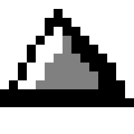
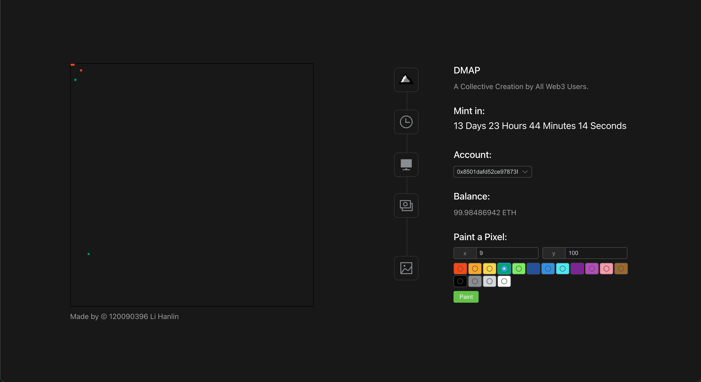

<!-- Improved compatibility of back to top link: See: https://github.com/othneildrew/Best-README-Template/pull/73 -->
<a name="readme-top"></a>

<!-- PROJECT LOGO -->
<br />
<div align="center">
  <a>
    
  </a>

  <h3 align="center">DMAP</h3>

  <p align="center">
    A Decentralized Application about an NFT created by all Web3 Users.
  </p>
</div>


<!-- ABOUT THE PROJECT -->
## About The Project



The project is inspired by the r/Place activity from APP Reddit. 

Each account gets to modify a pixel in an 128x128 image among 16 colors every 5 minutes.

The project would mint the final pictures to every account that stays on the painting.

<p align="right">(<a href="#readme-top">back to top</a>)</p>


### Built With

* [![Vue][Vue.js]][Vue-url]
* [![ElementPlus][ElementPlus]][Element-url]
* [![Truffle][Truffle]][Truffle-url]

<p align="right">(<a href="#readme-top">back to top</a>)</p>


<!-- GETTING STARTED -->
## Getting Started

### Prerequisites

* npm
  ```sh
  npm install npm@latest -g
  ```

### Installation
Check the Ganache doc to set up a local blockchain.

Deploy the smart contract:
* truffle
  ```sh
  truffle migrate
  ```

### Run Website
```sh
cd app
npm install
npm run dev
```

<p align="right">(<a href="#readme-top">back to top</a>)</p>


<!-- USAGE EXAMPLES -->
## Usage
The website provides 10 different accounts. By switching between them you can paint on the canvas quickly. Each account has 5 minutes CD time.

<p align="right">(<a href="#readme-top">back to top</a>)</p>


[Vue.js]: https://img.shields.io/badge/Vue.js-35495E?style=for-the-badge&logo=vuedotjs&logoColor=4FC08D
[Vue-url]: https://vuejs.org/

[Elementplus]: https://img.shields.io/badge/ElementPlus-35495E?style=for-the-badge&logo=elementplusio&logoColor=4FC08D
[Element-url]: https://element-plus.org/

[Truffle]: https://img.shields.io/badge/Truffle-35495E?style=for-the-badge&logo=truffle&logoColor=4FC08D
[Truffle-url]: https://trufflesuite.com/
